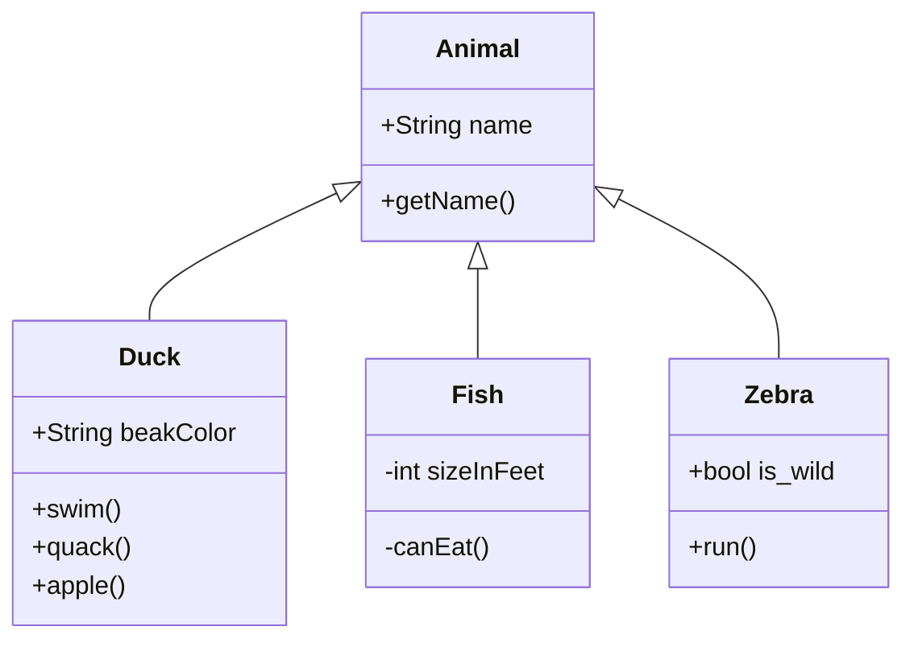

# pspp2023

```mermaid
classDiagram
    class Animal{
        +String name
        +getName()

    }
    class Duck{
      +String beakColor
      +swim()
      +quack()
      +apple()
    }
    class Fish{
      -int sizeInFeet
      -canEat()
    }
    class Zebra{
      +bool is_wild
      +run()
    }

    Animal <|-- Duck
    Animal <|-- Fish
    Animal <|-- Zebra

```
